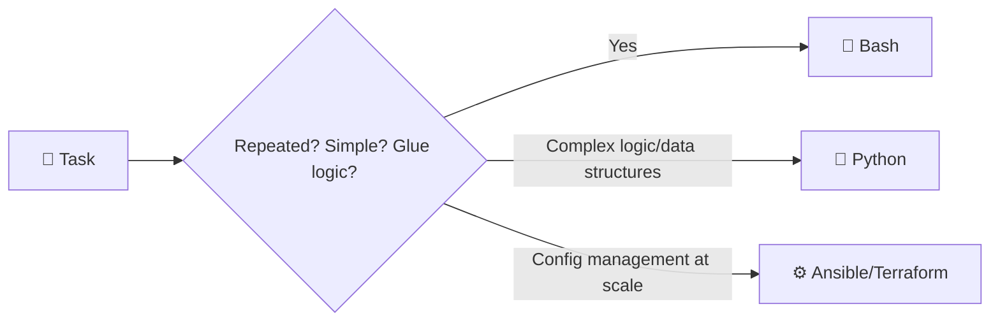
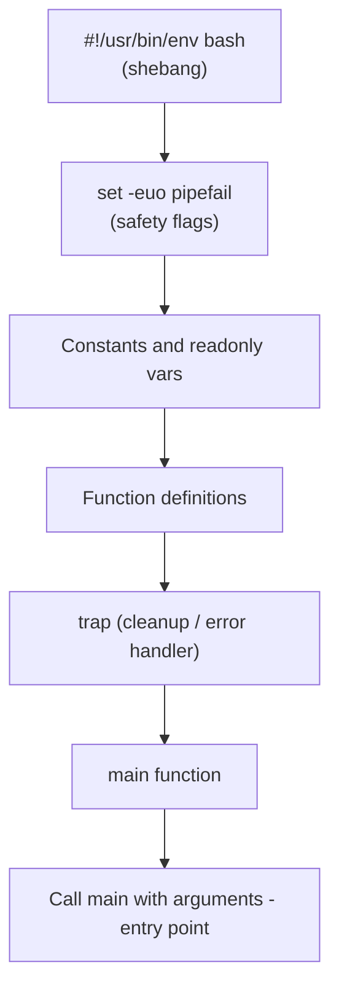
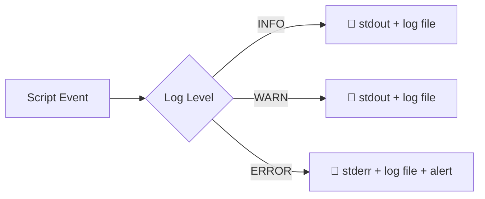
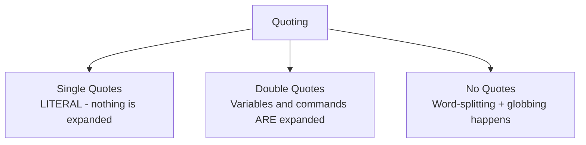
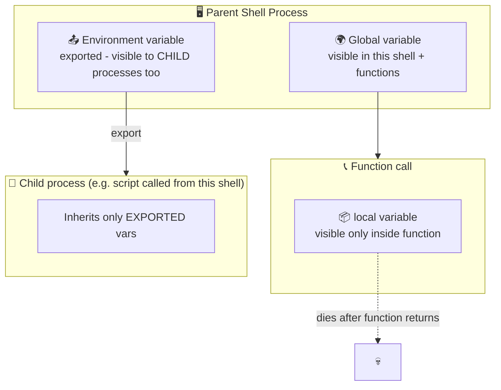
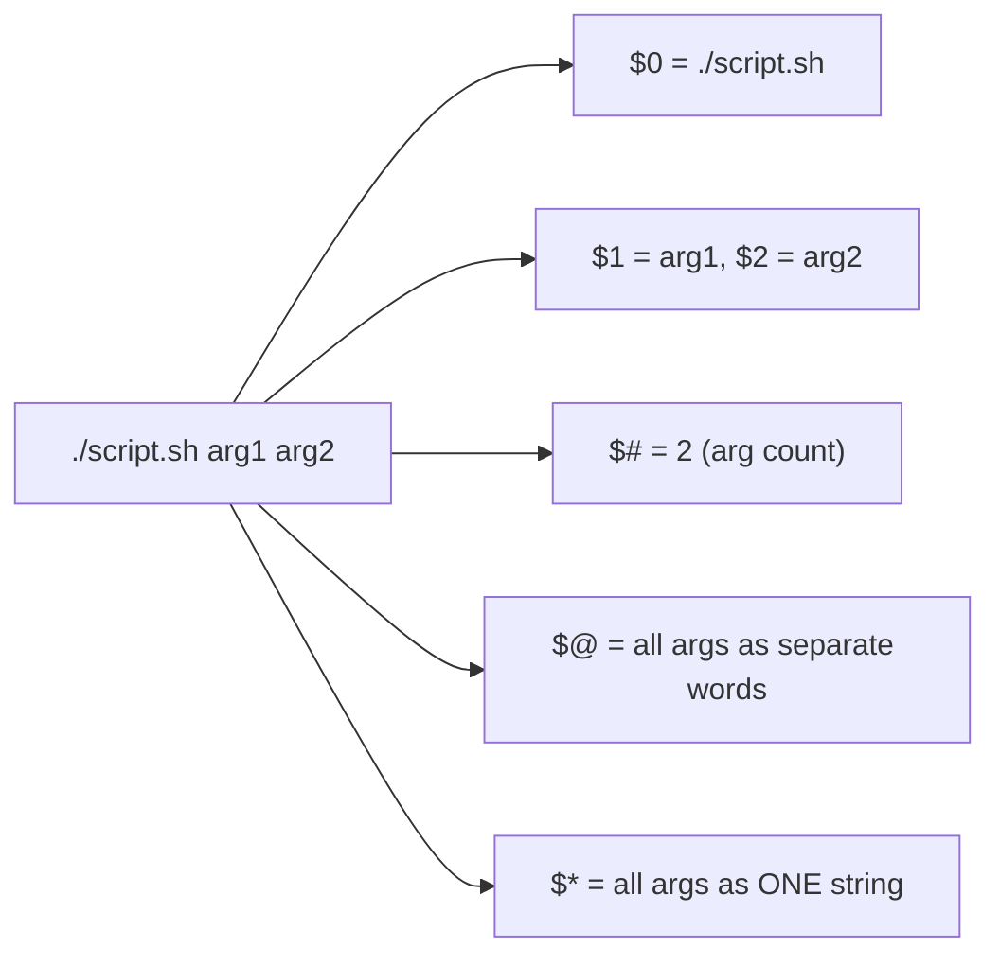
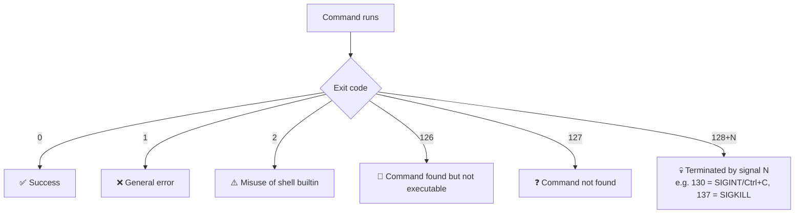
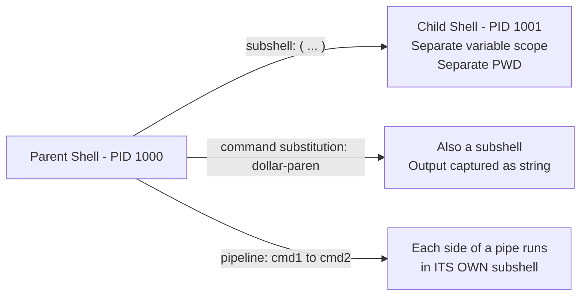
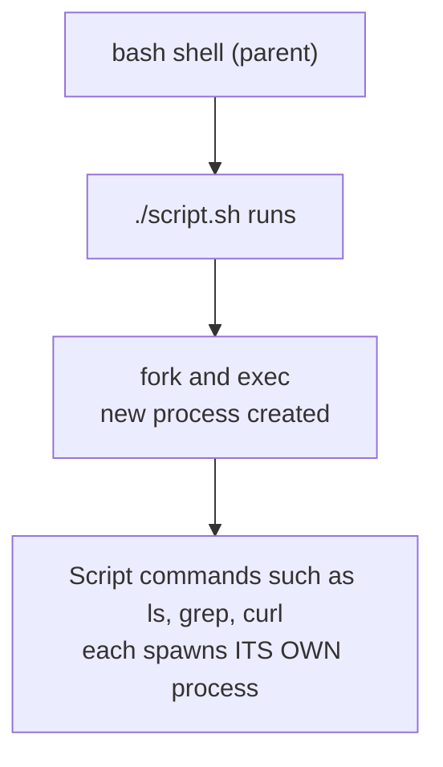
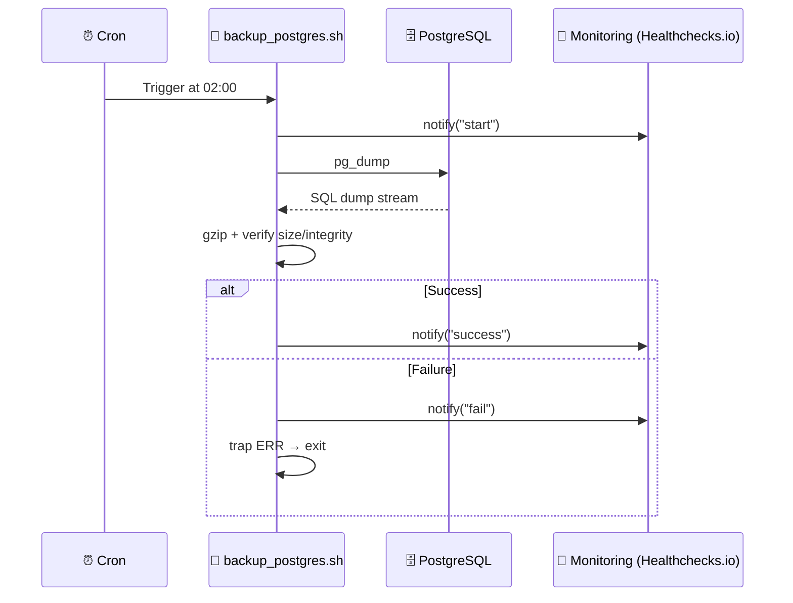

## 📚 Table of Contents

- [� Table of Contents](#-table-of-contents)
- [1. Why \& When to Use Bash in DevOps 🎯](#1-why--when-to-use-bash-in-devops-)
- [2. Anatomy of a Good Script 🏗️](#2-anatomy-of-a-good-script-️)
  - [🧱 Standard structure, top to bottom](#-standard-structure-top-to-bottom)
- [3. Best Practices ✅](#3-best-practices-)
- [4. Error Handling 🚨](#4-error-handling-)
  - [🧯 The 3 pillars: `set -e`, `trap`, and explicit checks](#-the-3-pillars-set--e-trap-and-explicit-checks)
  - [🔁 Retry logic (common in DevOps scripts)](#-retry-logic-common-in-devops-scripts)
  - [⚠️ `set -e` gotchas (know these — they bite everyone)](#️-set--e-gotchas-know-these--they-bite-everyone)
- [5. Logging 📝](#5-logging-)
  - [📦 Log rotation (don't let logs eat your disk!)](#-log-rotation-dont-let-logs-eat-your-disk)
- [6. Single Quotes `'` vs Double Quotes `"` 🔤](#6-single-quotes--vs-double-quotes--)
- [7. Variables: Local, Global, Environment 📦](#7-variables-local-global-environment-)
  - [🔍 Scope test](#-scope-test)
- [8. `env` vs `export` vs `set` vs `printf` vs `echo` 🧰](#8-env-vs-export-vs-set-vs-printf-vs-echo-)
- [9. Special Variables \& Exit Codes 🔢](#9-special-variables--exit-codes-)
  - [🎯 `$@` vs `$*` — the classic interview question](#--vs---the-classic-interview-question)
  - [🚦 Exit Codes — what they actually mean](#-exit-codes--what-they-actually-mean)
- [10. Under the Hood: How Bash Actually Runs Things 🔬](#10-under-the-hood-how-bash-actually-runs-things-)
  - [🧬 Subshells vs Current shell](#-subshells-vs-current-shell)
  - [🔗 Command substitution: ```cmd``` vs `$(cmd)`](#-command-substitution-cmd-vs-cmd)
  - [🎭 Process hierarchy of a script](#-process-hierarchy-of-a-script)
- [11. 🏆 Final Project: Production-Ready DB Backup Script](#11--final-project-production-ready-db-backup-script)
  - [⏰ Setting up the cron job](#-setting-up-the-cron-job)
- [12. Cheatsheet 📋](#12-cheatsheet-)
  - [🏁 Summary](#-summary)

---

## 1. Why & When to Use Bash in DevOps 🎯



Bash is the **glue language of DevOps**. You reach for it when:

| Use Case | Emoji | Why Bash fits |
|---|---|---|
| CI/CD pipeline steps | 🔄 | Every CI system (GitHub Actions, GitLab CI, Jenkins) runs shell natively |
| Server provisioning/bootstrapping | 🖥️ | No runtime/dependency needed — Bash ships with almost every Linux |
| Cron jobs (backups, cleanup, rotation) | ⏰ | Lightweight, fast startup, no interpreter overhead |
| Docker `ENTRYPOINT`/`CMD` wrappers | 🐳 | Base images already have `sh`/`bash` |
| Log parsing & quick automation | 📜 | Native integration with `grep`, `awk`, `sed`, `jq` |
| System administration (users, services, systemd) | 🛠️ | Direct access to OS commands, no abstraction layer |
| Health checks / monitoring glue scripts | 🩺 | Simple curl + exit code checks |

**When NOT to use Bash:** complex data structures, heavy string/JSON manipulation, unit-testable business logic, or anything > ~200 lines of real logic → reach for **Python** or **Go** instead. Bash doesn't scale well past "glue script" complexity.

---

## 2. Anatomy of a Good Script 🏗️

```bash
#!/usr/bin/env bash
#
# Script: backup_db.sh
# Purpose: Backup PostgreSQL DB, verify, and alert on failure
# Author:  Amin Khani
# Usage:   ./backup_db.sh [db_name]
#
set -euo pipefail            # 🛡️ Safety net (see Best Practices)
IFS=$'\n\t'                  # Prevent word-splitting surprises

# ─── Constants / Config ───────────────────────────────
readonly SCRIPT_DIR="$(cd "$(dirname "${BASH_SOURCE[0]}")" && pwd)"
readonly LOG_FILE="/var/log/backup_db.log"

# ─── Functions ─────────────────────────────────────────
log() { ... }
cleanup() { ... }
main() { ... }

# ─── Entry point ───────────────────────────────────────
trap cleanup EXIT
main "$@"
```

### 🧱 Standard structure, top to bottom



> 💡 Use `#!/usr/bin/env bash` instead of `#!/bin/bash` — it's portable across systems where bash isn't always at `/bin/bash` (e.g. some BSD/macOS setups with Homebrew bash).

---

## 3. Best Practices ✅

```bash
set -e          # exit immediately if a command fails
set -u          # error on undefined variables
set -o pipefail # a pipeline fails if ANY command in it fails, not just the last
```

| Practice | Emoji | Why |
|---|---|---|
| Always `set -euo pipefail` | 🛡️ | Fail fast instead of silently continuing with garbage state |
| Quote all variables: `"$var"` | 🔤 | Prevents word-splitting & globbing bugs |
| Use `readonly` for constants | 🔒 | Prevents accidental reassignment |
| Use functions, not top-to-bottom spaghetti | 🧩 | Testable, readable, reusable |
| Validate inputs/arguments early | ✅ | Fail before doing damage |
| Use `local` inside functions | 📦 | Avoid polluting global scope |
| Use `[[ ]]` instead of `[ ]` | 🆚 | Safer, supports `&&`/`||`/regex natively |
| Use `shellcheck` linter | 🔍 | Catches 90% of bash footguns before runtime |
| Never parse `ls` output | 🚫 | Use globs (`for f in *.txt`) instead |
| Always log with timestamps | 🕒 | Critical for debugging cron jobs later |
| Use `mktemp` for temp files | 🗑️ | Avoid collisions & path-traversal issues |
| Idempotency | 🔁 | Script should be safe to re-run without side effects |

```bash
# ❌ Bad
if [ $status = 0 ]; then

# ✅ Good
if [[ "$status" -eq 0 ]]; then
```

---

## 4. Error Handling 🚨

### 🧯 The 3 pillars: `set -e`, `trap`, and explicit checks

```bash
#!/usr/bin/env bash
set -euo pipefail

# 1️⃣ Trap errors and cleanup, even on Ctrl+C or unexpected exit
trap 'error_handler $? $LINENO' ERR
trap cleanup EXIT

error_handler() {
    local exit_code=$1
    local line_no=$2
    echo "❌ Error on line ${line_no}: exited with code ${exit_code}" >&2
    exit "$exit_code"
}

cleanup() {
    echo "🧹 Cleaning up temp files..."
    rm -f "$TMP_FILE" 2>/dev/null || true
}

# 2️⃣ Explicit checks for critical commands
if ! command -v pg_dump &> /dev/null; then
    echo "❌ pg_dump not found. Install postgresql-client." >&2
    exit 127
fi

# 3️⃣ Check command success explicitly when you need custom handling
if ! pg_dump mydb > backup.sql; then
    echo "❌ Backup failed!" >&2
    exit 1
fi
```

### 🔁 Retry logic (common in DevOps scripts)

```bash
retry() {
    local -r max_attempts=3
    local -r delay=5
    local attempt=1
    until "$@"; do
        if (( attempt == max_attempts )); then
            echo "❌ Command failed after ${max_attempts} attempts: $*" >&2
            return 1
        fi
        echo "⚠️ Attempt ${attempt} failed. Retrying in ${delay}s..."
        sleep "$delay"
        ((attempt++))
    done
}

retry curl -sf https://api.example.com/health
```

### ⚠️ `set -e` gotchas (know these — they bite everyone)

- `set -e` does **NOT** trigger inside `if condition; then` — that's intentional, condition failures are expected.
- `set -e` does **NOT** trigger for commands in a pipeline **except the last one**, unless `pipefail` is also set.
- `set -e` is **disabled inside a subshell run in `$(...)` if you check its exit code manually**.

```bash
# This will NOT stop the script even with set -e, because it's part of a condition:
if grep "error" file.log; then
    echo "found"
fi
```

---

## 5. Logging 📝



```bash
readonly LOG_FILE="/var/log/myscript.log"

log() {
    local level="$1"; shift
    local timestamp
    timestamp="$(date '+%Y-%m-%d %H:%M:%S')"
    echo "[${timestamp}] [${level}] $*" | tee -a "$LOG_FILE"
}

log_info()  { log "INFO"  "$@"; }
log_warn()  { log "WARN"  "$@"; }
log_error() { log "ERROR" "$@" >&2; }

log_info "Starting backup process 🚀"
log_error "Disk space low! ⚠️"
```

### 📦 Log rotation (don't let logs eat your disk!)
```bash
# /etc/logrotate.d/myscript
/var/log/myscript.log {
    weekly
    rotate 4
    compress
    missingok
    notifempty
}
```

> 💡 **Rule of thumb:** `stdout` = normal info, `stderr` = errors/warnings. Always redirect errors with `>&2` so monitoring tools and `2>` redirection can separate them.

---

## 6. Single Quotes `'` vs Double Quotes `"` 🔤



| Type | Variable expansion `$var` | Command substitution `$(cmd)` | Escape chars | Use case |
|---|---|---|---|---|
| `'single'` | ❌ No | ❌ No | ❌ No (except `'`) | Literal strings, regex patterns |
| `"double"` | ✅ Yes | ✅ Yes | ✅ Yes (`\$`, `` \` ``, `\"`, `\\`) | Almost everything else |
| (unquoted) | ✅ Yes | ✅ Yes | — | 🚫 Avoid — causes word-splitting bugs |

```bash
name="World"

echo 'Hello, $name!'     # Output: Hello, $name!   (literal)
echo "Hello, $name!"     # Output: Hello, World!   (expanded)

path="/tmp/my file.txt"
ls $path                 # 🚨 BREAKS: tries to ls "/tmp/my" and "file.txt" separately
ls "$path"                # ✅ Works: treats it as ONE argument
```

**Golden rule:** Default to `"double quotes"` for variables. Use `'single quotes'` only when you explicitly want zero expansion (like regex in `grep '$price'` or awk scripts).

---

## 7. Variables: Local, Global, Environment 📦



```bash
# 🌍 Global (shell-scoped) — visible everywhere in THIS script/shell
MY_VAR="hello"

my_function() {
    # 📦 Local — only visible inside this function
    local my_var="only here"
    echo "$my_var"        # hello only-here scope
}

# 📤 Environment variable — inherited by CHILD processes (subshells, scripts you call)
export DB_PASSWORD="secret123"
./another_script.sh       # this script CAN read $DB_PASSWORD

# 🔒 Readonly / constant
readonly MAX_RETRIES=3
```

### 🔍 Scope test
```bash
x="outer"
change_x() {
    local x="inner"
    echo "Inside function: $x"     # inner
}
change_x
echo "Outside function: $x"        # outer (unchanged — local didn't leak)
```

> ⚠️ **Common bug:** Forgetting `local` inside a function silently makes the variable **global**, which can overwrite variables elsewhere in the script.

---

## 8. `env` vs `export` vs `set` vs `printf` vs `echo` 🧰

| Command | Purpose | Example |
|---|---|---|
| `export VAR=value` | Marks a shell variable to be passed to **child processes** | `export PATH=$PATH:/opt/bin` |
| `env` | Shows (or runs a command with) the **current environment variables** | `env`, `env NODE_ENV=production node app.js` |
| `set` | Shows/sets **shell options and shell variables** (including non-exported ones) | `set -euo pipefail`, `set` (list all vars) |
| `echo` | Prints text, simple, but **inconsistent across shells** for escape sequences | `echo "Hello $USER"` |
| `printf` | Prints text with **precise formatting** — POSIX-consistent, safer | `printf "%s: %d\n" "count" 5` |

```bash
# env vs export
MY_VAR="local only"
env | grep MY_VAR          # ❌ nothing — not exported yet

export MY_VAR
env | grep MY_VAR           # ✅ MY_VAR=local only

# Run a command with a temporary env override (without polluting your shell)
env DEBUG=true ./script.sh

# set: shell options
set -x     # 🔍 debug mode — prints every command before executing (great for troubleshooting!)
set +x     # turn it off

# echo vs printf
echo "50% done"              # 50% done
printf "%d%% done\n" 50      # 50% done  (safer with format specifiers)

echo "Tab:\there"            # Tab:\there   (literal, unless -e flag used)
echo -e "Tab:\there"         # Tab:    here (interprets escape sequences)
printf "Tab:\there\n"        # Tab:    here (printf ALWAYS interprets \t \n etc.)
```

> 💡 **Best practice:** Prefer `printf` over `echo` in production scripts — `echo`'s behavior with `-e`/`-n` flags and backslashes differs across `sh`, `dash`, and `bash`, which causes portability bugs.

---

## 9. Special Variables & Exit Codes 🔢



| Variable | Meaning | Example |
|---|---|---|
| `$0` | Name of the script itself | `echo "Running $0"` |
| `$1`, `$2`, ... | Positional arguments | `./script.sh foo bar` → `$1=foo`, `$2=bar` |
| `$#` | Number of arguments passed | `$#` → `2` |
| `$@` | All arguments, **each quoted separately** (preferred for loops) | `for arg in "$@"` |
| `$*` | All arguments as **one single string** | `echo "$*"` → `foo bar` |
| `$?` | Exit code of the **last executed command** | `ls /tmp; echo $?` → `0` |
| `$$` | PID of the **current shell/script** | Useful for unique temp filenames |
| `$!` | PID of the **last background process** | `sleep 10 & echo $!` |
| `$PWD` | Current working directory | `echo $PWD` |
| `$OLDPWD` | Previous working directory (before last `cd`) | after `cd`, `cd -` uses this |
| `$HOME` | Current user's home directory | |
| `$RANDOM` | A random integer (0–32767) | good for temp suffixes |

### 🎯 `$@` vs `$*` — the classic interview question
```bash
set -- "hello world" "foo"

for a in "$@"; do echo "[$a]"; done
# [hello world]
# [foo]              ✅ preserves argument boundaries

for a in "$*"; do echo "[$a]"; done
# [hello world foo]  ❌ merges everything into ONE string
```

### 🚦 Exit Codes — what they actually mean



```bash
grep "pattern" file.txt
echo $?          # 0 = found, 1 = not found, 2 = file error

my_function() {
    return 42     # functions use 'return' for exit codes (0-255)
}
my_function
echo $?           # 42

exit 1            # exits the WHOLE SCRIPT with code 1
```

> 📌 **`$?` must be checked IMMEDIATELY** after the command — any command in between (even `echo`) overwrites it.

---

## 10. Under the Hood: How Bash Actually Runs Things 🔬

### 🧬 Subshells vs Current shell

```bash
(cd /tmp && rm -rf *)     # ✅ runs in a SUBSHELL — cd doesn't affect your main script's PWD
cd /tmp && rm -rf *       # ⚠️ runs in CURRENT shell — changes your script's actual directory
```



**⚠️ The classic pipe-subshell bug:**
```bash
count=0
cat file.txt | while read -r line; do
    ((count++))
done
echo "$count"     # ❌ prints 0! The while loop ran in a SUBSHELL (because of the pipe)
                  #    so 'count' incremented in the subshell, not here.

# ✅ Fix: use process substitution instead of a pipe
count=0
while read -r line; do
    ((count++))
done < <(cat file.txt)
echo "$count"     # ✅ correct count — no subshell involved
```

### 🔗 Command substitution: `` `cmd` `` vs `$(cmd)`
```bash
old_style=`date`        # ⚠️ legacy, hard to nest
new_style=$(date)       # ✅ modern, nests cleanly: $(cmd1 $(cmd2))
```

### 🎭 Process hierarchy of a script


Every external command (`ls`, `grep`, `curl`) forks a **new process**. Bash built-ins (`cd`, `echo`, `[[`, `read`) do **not** fork — they run inside the current shell process, which is why `cd` in a subshell doesn't affect the parent.

---

## 11. 🏆 Final Project: Production-Ready DB Backup Script

Features: ✅ error handling, ✅ logging, ✅ size verification, ✅ retention cleanup, ✅ monitoring webhook (e.g. Slack/Healthchecks.io), ✅ cron-ready.

```bash
#!/usr/bin/env bash
#
# ==============================================================
# Script:  backup_postgres.sh
# Purpose: Backup a PostgreSQL DB, verify integrity/size,
#          rotate old backups, and report status to monitoring.
# Usage:   ./backup_postgres.sh
# Cron:    0 2 * * *  /opt/scripts/backup_postgres.sh >> /var/log/backup_cron.log 2>&1
# ==============================================================

set -euo pipefail
IFS=$'\n\t'

# ─── Configuration ──────────────────────────────────────────
readonly DB_NAME="${DB_NAME:-myapp_production}"
readonly DB_USER="${DB_USER:-postgres}"
readonly DB_HOST="${DB_HOST:-localhost}"
readonly BACKUP_DIR="/var/backups/postgres"
readonly LOG_FILE="/var/log/backup_postgres.log"
readonly RETENTION_DAYS=7
readonly MIN_BACKUP_SIZE_KB=100        # sanity check: fail if backup suspiciously small
readonly TIMESTAMP="$(date '+%Y%m%d_%H%M%S')"
readonly BACKUP_FILE="${BACKUP_DIR}/${DB_NAME}_${TIMESTAMP}.sql.gz"
readonly MONITORING_URL="${MONITORING_URL:-https://hc-ping.com/YOUR-UUID-HERE}"

mkdir -p "$BACKUP_DIR"

# ─── Logging helpers ────────────────────────────────────────
log() {
    local level="$1"; shift
    echo "[$(date '+%Y-%m-%d %H:%M:%S')] [${level}] $*" | tee -a "$LOG_FILE"
}
log_info()  { log "INFO"  "$@"; }
log_warn()  { log "WARN"  "$@"; }
log_error() { log "ERROR" "$@" >&2; }

# ─── Monitoring notification (Healthchecks.io / Slack / etc.) ─
notify() {
    local status="$1"   # "success" | "fail" | "start"
    local message="$2"

    case "$status" in
        start)   curl -fsS -m 10 --retry 3 "${MONITORING_URL}/start" -d "$message" || true ;;
        success) curl -fsS -m 10 --retry 3 "${MONITORING_URL}"       -d "$message" || true ;;
        fail)    curl -fsS -m 10 --retry 3 "${MONITORING_URL}/fail"  -d "$message" || true ;;
    esac
}

# ─── Error trap ─────────────────────────────────────────────
error_handler() {
    local exit_code=$1
    local line_no=$2
    log_error "Script failed at line ${line_no} with exit code ${exit_code}"
    notify "fail" "❌ Backup failed on $(hostname) at line ${line_no} (exit ${exit_code})"
    exit "$exit_code"
}
trap 'error_handler $? $LINENO' ERR

cleanup() {
    log_info "Cleanup complete."
}
trap cleanup EXIT

# ─── Pre-flight checks ──────────────────────────────────────
preflight_checks() {
    log_info "Running pre-flight checks..."

    if ! command -v pg_dump &> /dev/null; then
        log_error "pg_dump not found. Install postgresql-client."
        exit 127
    fi

    if ! pg_isready -h "$DB_HOST" -U "$DB_USER" &> /dev/null; then
        log_error "Database is not reachable at ${DB_HOST}"
        exit 1
    fi

    local available_kb
    available_kb=$(df --output=avail "$BACKUP_DIR" | tail -1 | tr -d ' ')
    if (( available_kb < 1048576 )); then   # < 1GB free
        log_warn "Low disk space: ${available_kb}KB available in ${BACKUP_DIR}"
    fi

    log_info "Pre-flight checks passed. ✅"
}

# ─── Backup step ────────────────────────────────────────────
run_backup() {
    log_info "Starting backup of '${DB_NAME}' -> ${BACKUP_FILE}"

    if pg_dump -h "$DB_HOST" -U "$DB_USER" "$DB_NAME" | gzip > "$BACKUP_FILE"; then
        log_info "pg_dump completed successfully."
    else
        log_error "pg_dump failed!"
        rm -f "$BACKUP_FILE"
        exit 1
    fi
}

# ─── Verify backup size/integrity ───────────────────────────
verify_backup() {
    if [[ ! -f "$BACKUP_FILE" ]]; then
        log_error "Backup file was not created: ${BACKUP_FILE}"
        exit 1
    fi

    local size_kb
    size_kb=$(du -k "$BACKUP_FILE" | cut -f1)

    if (( size_kb < MIN_BACKUP_SIZE_KB )); then
        log_error "Backup file suspiciously small (${size_kb}KB) — possible corrupt/empty dump."
        exit 1
    fi

    if ! gzip -t "$BACKUP_FILE" 2>/dev/null; then
        log_error "Backup file failed gzip integrity test."
        exit 1
    fi

    log_info "Backup verified: ${size_kb}KB, gzip integrity OK. ✅"
    echo "$size_kb"
}

# ─── Retention: delete backups older than N days ────────────
rotate_old_backups() {
    log_info "Rotating backups older than ${RETENTION_DAYS} days..."
    find "$BACKUP_DIR" -name "${DB_NAME}_*.sql.gz" -mtime "+${RETENTION_DAYS}" -print -delete \
        | while read -r deleted; do log_info "Deleted old backup: ${deleted}"; done
    log_info "Rotation complete."
}

# ─── Main ────────────────────────────────────────────────────
main() {
    log_info "===== Backup job started ====="
    notify "start" "🚀 Backup starting for ${DB_NAME} on $(hostname)"

    preflight_checks
    run_backup
    local final_size_kb
    final_size_kb=$(verify_backup)
    rotate_old_backups

    log_info "===== Backup job finished successfully ====="
    notify "success" "✅ Backup succeeded: ${BACKUP_FILE} (${final_size_kb}KB)"
}

main "$@"
```

### ⏰ Setting up the cron job

```bash
# Edit crontab
crontab -e

# Run every day at 2:00 AM, with env vars set, logging everything
0 2 * * * DB_NAME=myapp_production DB_USER=postgres MONITORING_URL=https://hc-ping.com/xxxx \
    /opt/scripts/backup_postgres.sh >> /var/log/backup_cron.log 2>&1
```



> 🔒 **Security tip (relevant to your field):** Never hardcode `DB_PASSWORD` in the script. Use a `.pgpass` file (`chmod 600`) or environment injection via a secrets manager (Vault, AWS Secrets Manager, Docker secrets) instead.

---

## 12. Cheatsheet 📋

```bash
# Safety header for every script
set -euo pipefail
IFS=$'\n\t'

# Check if a variable is set
[[ -z "${VAR:-}" ]] && echo "VAR is unset or empty"

# Default value if unset
NAME="${NAME:-default_value}"

# String comparisons
[[ "$a" == "$b" ]]
[[ "$a" != "$b" ]]
[[ -z "$a" ]]   # empty
[[ -n "$a" ]]   # not empty

# Numeric comparisons
(( a > b ))
[[ "$a" -gt "$b" ]]

# File tests
[[ -f "$file" ]]   # regular file exists
[[ -d "$dir" ]]    # directory exists
[[ -x "$file" ]]   # executable
[[ -r "$file" ]]   # readable

# Loop over arguments
for arg in "$@"; do echo "$arg"; done

# Arrays
arr=("a" "b" "c")
echo "${arr[@]}"      # all elements
echo "${#arr[@]}"      # length

# Debug mode
bash -x script.sh
set -x   # inside a script
```

---

### 🏁 Summary

> Bash is the **connective tissue of DevOps** — cron jobs, CI/CD steps, provisioning, and quick automation all run through it. The difference between a hobby script and a **production-grade** one comes down to: `set -euo pipefail`, proper quoting, `trap`-based error handling, structured logging, and treating every external dependency (disk space, DB connectivity, command availability) as something that **can and will fail**. 🛡️