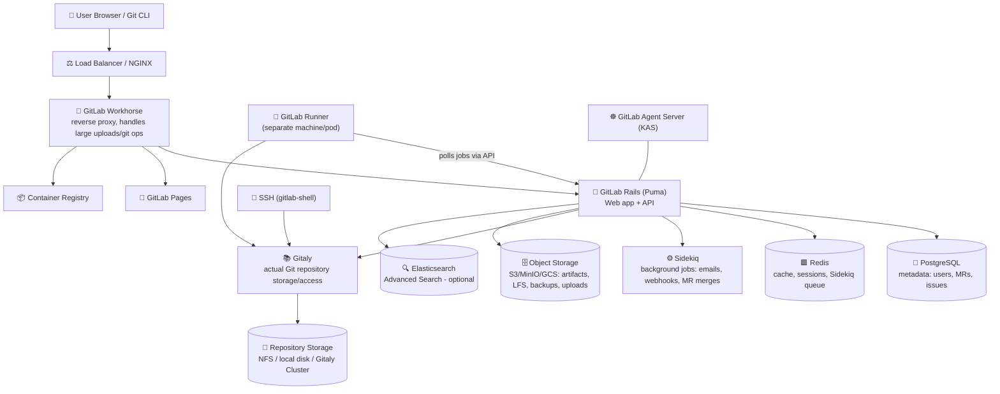
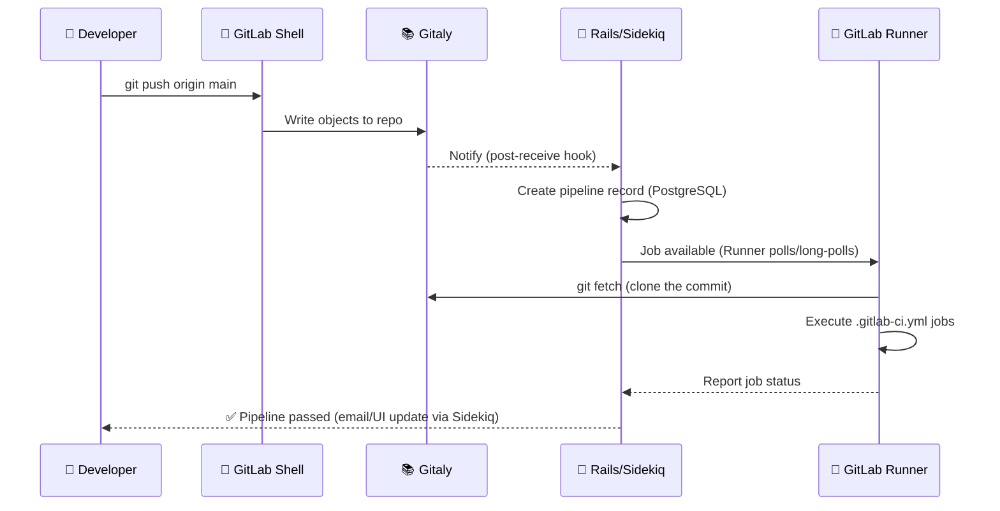
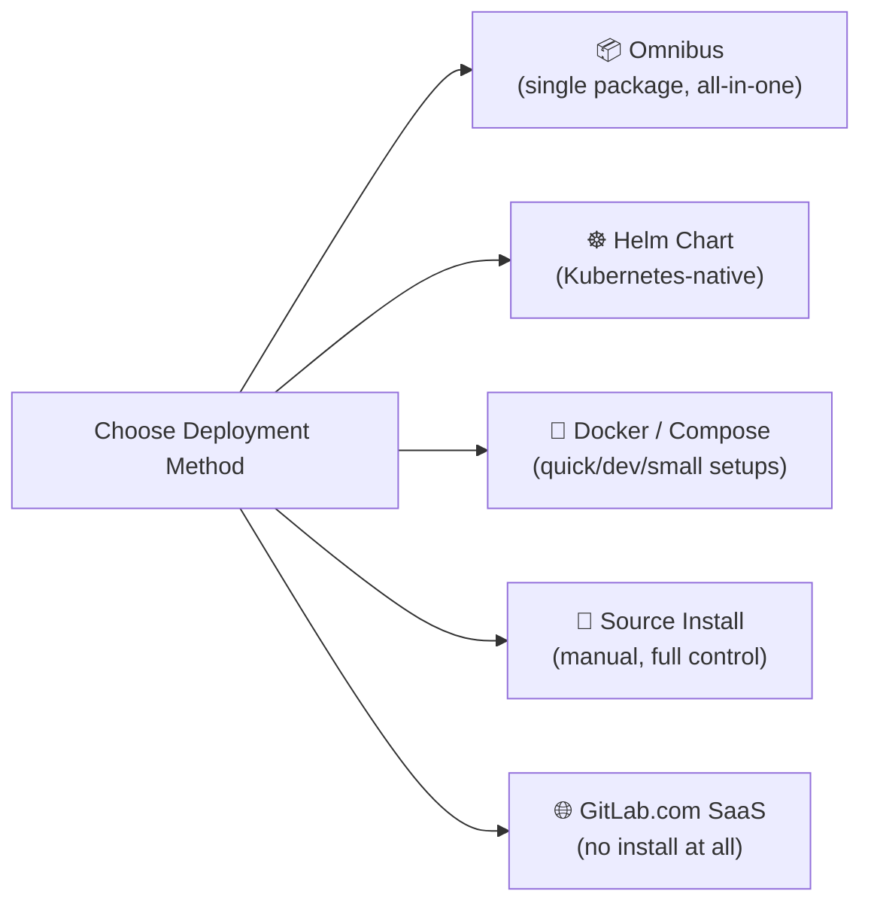
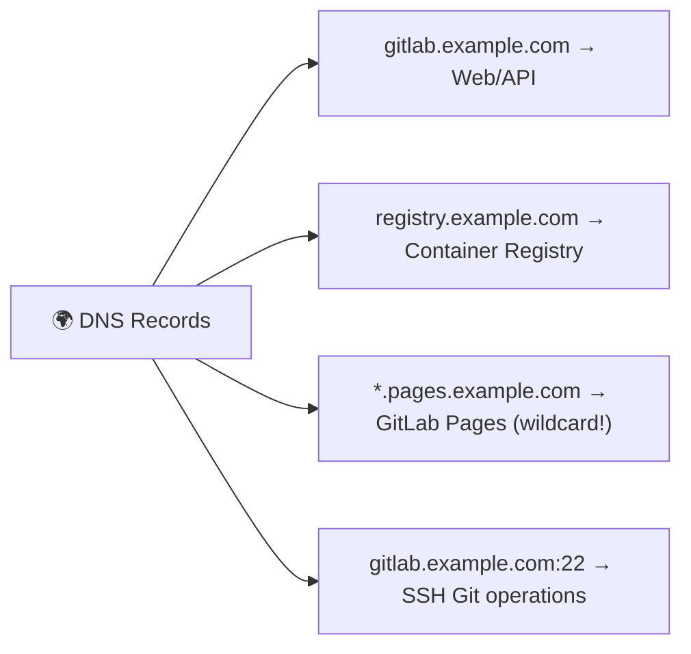
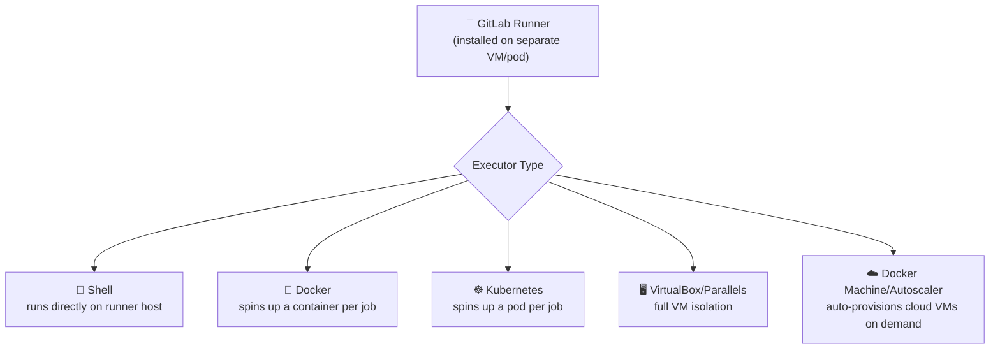
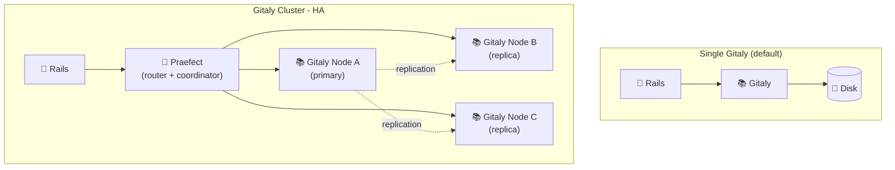
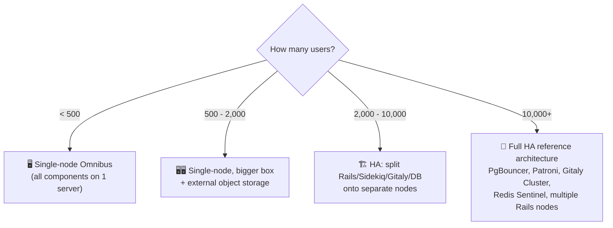
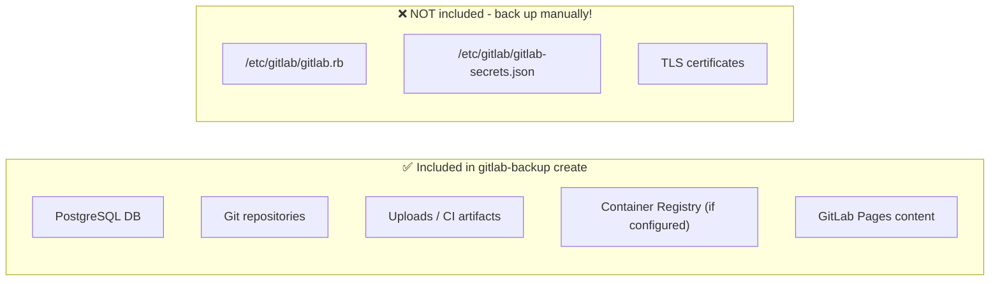
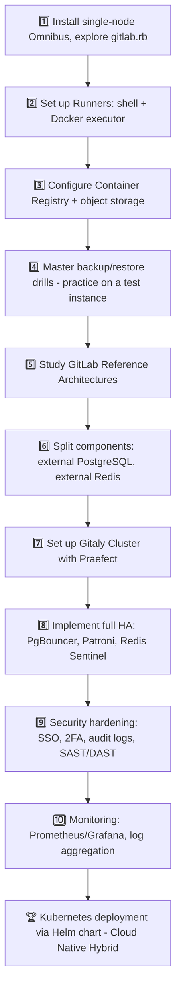

## 📚 Table of Contents

- [📚 Table of Contents](#-table-of-contents)
- [1. What is GitLab? Editions \& Deployment Options 🦊](#1-what-is-gitlab-editions--deployment-options-)
- [2. High-Level Architecture 🏗️](#2-high-level-architecture-️)
  - [🎯 The golden rule of GitLab architecture](#-the-golden-rule-of-gitlab-architecture)
- [3. Core Components Deep Dive 🔬](#3-core-components-deep-dive-)
  - [🔄 Request flow example: `git push`](#-request-flow-example-git-push)
- [4. Self-Hosting Approaches Compared 🧩](#4-self-hosting-approaches-compared-)
- [5. Installing GitLab with Omnibus 🐳](#5-installing-gitlab-with-omnibus-)
  - [Step 1 — Install dependencies \& repository](#step-1--install-dependencies--repository)
  - [Step 2 — Install GitLab, set the external URL](#step-2--install-gitlab-set-the-external-url)
  - [Step 3 — The main config file: `/etc/gitlab/gitlab.rb`](#step-3--the-main-config-file-etcgitlabgitlabrb)
  - [Step 4 — Apply configuration](#step-4--apply-configuration)
  - [🧰 Essential `gitlab-ctl` commands](#-essential-gitlab-ctl-commands)
- [6. Directory Structure 📁](#6-directory-structure-)
- [7. External URLs \& Networking 🌐](#7-external-urls--networking-)
- [8. Container Registry Setup 📦](#8-container-registry-setup-)
  - [Enable it in Omnibus](#enable-it-in-omnibus)
  - [Using it](#using-it)
- [9. GitLab Runner Deep Dive 🏃](#9-gitlab-runner-deep-dive-)
- [10. Gitaly \& Gitaly Cluster (Praefect) 📚](#10-gitaly--gitaly-cluster-praefect-)
- [11. HA vs Single-Node — When to Use What ⚖️](#11-ha-vs-single-node--when-to-use-what-️)
  - [🏛️ GitLab's official Reference Architectures](#️-gitlabs-official-reference-architectures)
- [12. Performance Best Practices 🚀](#12-performance-best-practices-)
- [13. Security Best Practices 🔒](#13-security-best-practices-)
- [14. Backup \& Restore 💾](#14-backup--restore-)
  - [🗄️ Full backup](#️-full-backup)
  - [⚠️ What's INCLUDED vs EXCLUDED by default](#️-whats-included-vs-excluded-by-default)
  - [🎯 Selective backup (skip large components)](#-selective-backup-skip-large-components)
  - [♻️ Restore procedure](#️-restore-procedure)
  - [🤖 Automating it (cron)](#-automating-it-cron)
- [15. Mastery Roadmap 🎓](#15-mastery-roadmap-)
  - [📖 Key resources](#-key-resources)
  - [🏁 Summary](#-summary)

---

## 1. What is GitLab? Editions & Deployment Options 🦊

GitLab is a **single application** covering the entire DevOps lifecycle: source control, CI/CD, container registry, package registry, security scanning, and project management — unlike GitHub+Jenkins+Artifactory+Jira stacks glued together.

| Edition | Emoji | Notes |
|---|---|---|
| **CE (Community Edition)** | 🆓 | Free, open-source (MIT), core Git + CI/CD features |
| **EE (Enterprise Edition)** | 💼 | Adds HA features, advanced security (SAST/DAST), compliance, ADO features — license-gated |
| **GitLab.com (SaaS)** | ☁️ | Fully managed by GitLab Inc. — no infra to manage |
| **GitLab Dedicated** | 🏢 | Single-tenant managed instance for enterprises |
| **Self-Managed** | 🏠 | You install & operate it — this guide's focus |

---

## 2. High-Level Architecture 🏗️



### 🎯 The golden rule of GitLab architecture
> **Rails app = brain (business logic + UI)**. **Gitaly = the actual Git data**. **Runner = where your CI/CD jobs execute** (usually on completely separate infrastructure from GitLab itself). Everything else supports these three.

---

## 3. Core Components Deep Dive 🔬

| Component | Emoji | Role |
|---|---|---|
| **GitLab Rails (Puma)** | 💎 | The core Ruby-on-Rails monolith: web UI, REST/GraphQL API, business logic |
| **GitLab Workhorse** | 🚪 | Go reverse proxy in front of Rails — offloads slow requests (git clone/push, file uploads, LFS) so Puma workers aren't blocked |
| **GitLab Shell** | 🔑 | Handles Git operations over **SSH** (`git@gitlab...`), talks to Gitaly |
| **Gitaly** | 📚 | Go service that stores and serves **actual Git repository data** (replaces old direct NFS access) |
| **Praefect** | 🧭 | The **manager/proxy for Gitaly Cluster** — routes requests to Gitaly replicas, handles replication & failover |
| **Sidekiq** | ⚙️ | Background job processor (emails, webhooks, CI pipeline triggers, MR merge trains, project exports) |
| **PostgreSQL** | 🐘 | Primary relational database — users, projects, issues, MRs, pipelines metadata |
| **Redis** | 🟥 | In-memory store — caching, session storage, Sidekiq job queue, rate limiting |
| **GitLab Runner** | 🏃 | Separate agent that **executes your CI/CD jobs** (shell, Docker, Kubernetes, VM executors) |
| **Container Registry** | 📦 | Docker-compatible image registry, built on Docker Distribution |
| **GitLab Pages** | 📄 | Static site hosting straight from your repo (like GitHub Pages) |
| **GitLab Agent Server (KAS)** | ☸️ | Enables GitOps-style pull-based deployments to Kubernetes clusters |
| **Elasticsearch/OpenSearch** | 🔍 | Optional — powers "Advanced Search" across code/commits/issues (EE feature) |
| **Object Storage** | 🗄️ | S3-compatible storage for artifacts, LFS objects, uploads, backups, registry blobs (recommended for HA/scale) |
| **Consul** | 🗳️ | Service discovery + health checks in HA PostgreSQL setups (Patroni-based) |
| **PgBouncer** | 🔀 | PostgreSQL connection pooler, essential at scale |

### 🔄 Request flow example: `git push`



---

## 4. Self-Hosting Approaches Compared 🧩



| Method | Emoji | Best for | Complexity |
|---|---|---|---|
| **Omnibus package** | 📦 | Most self-hosted installs, single-server or simple HA | 🟢 Low — recommended default |
| **Helm Chart (Cloud Native Hybrid)** | ☸️ | Kubernetes shops needing autoscaling of stateless components | 🟡 Medium-High |
| **Docker / docker-compose** | 🐳 | Dev/test, small teams, quick evaluation | 🟢 Low |
| **Source install** | 🧵 | Full customization, unsupported OS, academic/learning purposes | 🔴 High — not recommended for prod |
| **GitLab.com SaaS** | ☁️ | No ops overhead wanted at all | ⚪ None (managed) |

> 🏆 **Recommended default:** **Omnibus** for 90% of self-hosted use cases — it bundles GitLab, PostgreSQL, Redis, NGINX, Gitaly, Sidekiq, Puma, and more into ONE package, configured through a single file (`gitlab.rb`) and orchestrated by embedded **Chef recipes** via `gitlab-ctl reconfigure`.

---

## 5. Installing GitLab with Omnibus 🐳

### Step 1 — Install dependencies & repository
```bash
sudo apt update
sudo apt install -y curl openssh-server ca-certificates tzdata perl postfix

curl https://packages.gitlab.com/install/repositories/gitlab/gitlab-ee/script.deb.sh | sudo bash
```

### Step 2 — Install GitLab, set the external URL
```bash
sudo EXTERNAL_URL="https://gitlab.example.com" apt install gitlab-ee
```
This triggers the first `gitlab-ctl reconfigure` automatically.

### Step 3 — The main config file: `/etc/gitlab/gitlab.rb`
```ruby
external_url 'https://gitlab.example.com'

# Let's Encrypt (built-in!)
letsencrypt['enable'] = true
letsencrypt['contact_emails'] = ['admin@example.com']

# PostgreSQL tuning
postgresql['shared_buffers'] = "2GB"

# Redis
redis['bind'] = '127.0.0.1'

# Backup location
gitlab_rails['backup_path'] = "/var/opt/gitlab/backups"
gitlab_rails['backup_keep_time'] = 604800  # 7 days

# Object storage (recommended for production)
gitlab_rails['object_store']['enabled'] = true
gitlab_rails['object_store']['connection'] = {
  'provider' => 'AWS',
  'region' => 'us-east-1',
  'aws_access_key_id' => 'ACCESS_KEY',
  'aws_secret_access_key' => 'SECRET_KEY'
}
```

### Step 4 — Apply configuration
```bash
sudo gitlab-ctl reconfigure   # Applies gitlab.rb via Chef recipes
sudo gitlab-ctl restart       # Restart services if needed
```

### 🧰 Essential `gitlab-ctl` commands
```bash
gitlab-ctl status              # 📊 Show all service statuses
gitlab-ctl tail                # 📜 Tail ALL logs live
gitlab-ctl tail sidekiq        # 📜 Tail just one service's logs
gitlab-ctl restart puma        # 🔄 Restart one component
gitlab-rake gitlab:check       # 🩺 Run health checks
gitlab-rake gitlab:env:info    # ℹ️  Show system info/versions
```

---

## 6. Directory Structure 📁

```mermaid
flowchart TD
    A["/etc/gitlab/"] --> A1["gitlab.rb  ⚙️ main config"]
    A --> A2["gitlab-secrets.json 🔒 encryption keys - BACKUP THIS!"]
    A --> A3["ssl/  🔐 TLS certs"]

    B["/var/opt/gitlab/"] --> B1["git-data/repositories/ 📚 Git repos (or Gitaly storage)"]
    B --> B2["postgresql/ 🐘 DB files"]
    B --> B3["redis/ 🟥 Redis persistence"]
    B --> B4["gitlab-rails/uploads/ 🖼️ avatars, attachments"]
    B --> B5["backups/ 💾 backup tarballs"]
    B --> B6["gitlab-ci/builds/ 🏃 CI artifacts (if local storage)"]

    C["/var/log/gitlab/"] --> C1["gitlab-rails/ 📜 production.log, api_json.log"]
    C --> C2["gitaly/ 📜 gitaly logs"]
    C --> C3["sidekiq/ 📜 background job logs"]
    C --> C4["nginx/ 📜 access/error logs"]
    C --> C5["postgresql/ 📜 DB logs"]
```



| Path | Emoji | Contains |
|---|---|---|
| `/etc/gitlab/gitlab.rb` | ⚙️ | **THE** config file — everything is set here |
| `/etc/gitlab/gitlab-secrets.json` | 🔒 | Encryption keys/secrets — **losing this = losing access to encrypted data** |
| `/var/opt/gitlab/` | 💾 | ALL persistent data: repos, DB, Redis, uploads |
| `/var/opt/gitlab/git-data/repositories` | 📚 | Default Git repo storage location |
| `/var/opt/gitlab/backups` | 🗄️ | Default backup tarball destination |
| `/var/log/gitlab/` | 📜 | All component logs, organized by service subfolder |

> 🔒 **Critical backup reminder:** `gitlab-secrets.json` and `gitlab.rb` are **NOT** included in `gitlab-backup create` — you must back them up **separately**, or a restore will fail to decrypt CI variables, 2FA secrets, and more.

---

## 7. External URLs & Networking 🌐

GitLab has **multiple external-facing URLs**, each independently configurable:

```ruby
# /etc/gitlab/gitlab.rb

external_url 'https://gitlab.example.com'                 # 🌐 Main web UI/API
registry_external_url 'https://registry.example.com'      # 📦 Container Registry
pages_external_url 'https://pages.example.com'             # 📄 GitLab Pages (wildcard DNS needed)
mattermost_external_url 'https://chat.example.com'         # 💬 Mattermost (if bundled)

# SSH (git operations) - can run on a different port
gitlab_rails['gitlab_shell_ssh_port'] = 2222
```



> 💡 Each of these can point to a **different port, subdomain, or even different load balancer** — this matters a lot when designing HA architectures with separate ingress paths for Git traffic vs. registry pulls vs. web UI.

---

## 8. Container Registry Setup 📦

### Enable it in Omnibus
```ruby
registry_external_url 'https://registry.example.com'

# If registry needs its own cert (recommended)
registry_nginx['ssl_certificate'] = "/etc/gitlab/ssl/registry.example.com.crt"
registry_nginx['ssl_certificate_key'] = "/etc/gitlab/ssl/registry.example.com.key"

# Storage backend (S3 recommended for production)
registry['storage'] = {
  's3' => {
    'accesskey' => 'ACCESS_KEY',
    'secretkey' => 'SECRET_KEY',
    'bucket'    => 'gitlab-registry-bucket',
    'region'    => 'us-east-1'
  }
}
```

```bash
sudo gitlab-ctl reconfigure
```

### Using it
```bash
docker login registry.example.com
docker build -t registry.example.com/group/project:latest .
docker push registry.example.com/group/project:latest
```

Then reference it directly in `.gitlab-ci.yml`:
```yaml
build:
  image: docker:24
  services: [docker:24-dind]
  script:
    - docker build -t $CI_REGISTRY_IMAGE:$CI_COMMIT_SHORT_SHA .
    - docker login -u $CI_REGISTRY_USER -p $CI_REGISTRY_PASSWORD $CI_REGISTRY
    - docker push $CI_REGISTRY_IMAGE:$CI_COMMIT_SHORT_SHA
```

> ✅ GitLab automatically injects `$CI_REGISTRY`, `$CI_REGISTRY_IMAGE`, `$CI_REGISTRY_USER`, `$CI_REGISTRY_PASSWORD` into every pipeline — no manual secret setup needed for the **project's own registry**.

---

## 9. GitLab Runner Deep Dive 🏃



| Concept | Emoji | Meaning |
|---|---|---|
| **Runner registration** | 📝 | `gitlab-runner register` — links runner to a project/group/instance with a token |
| **Shared vs Group vs Project runner** | 🌐/👥/📁 | Scope of which pipelines can use this runner |
| **Tags** | 🏷️ | Match jobs to specific runners (e.g. `tags: [docker, gpu]`) |
| **Concurrent** | 🔢 | Max parallel jobs a single runner instance can execute |
| **Executor** | ⚙️ | HOW the job actually runs (Docker is most common/isolated) |

```bash
# Install & register a runner
curl -L https://packages.gitlab.com/install/repositories/runner/gitlab-runner/script.deb.sh | sudo bash
sudo apt install gitlab-runner

sudo gitlab-runner register \
  --url "https://gitlab.example.com" \
  --registration-token "TOKEN" \
  --executor "docker" \
  --docker-image "alpine:latest" \
  --tag-list "docker,linux"
```

> 🔑 **Key architectural point:** GitLab Runner is **NOT** installed as part of the Omnibus package — it's a **separate binary/component**, usually on **separate infrastructure**, that just needs network access to your GitLab instance's API. This is intentional: it lets you scale compute independently of your GitLab server.

---

## 10. Gitaly & Gitaly Cluster (Praefect) 📚



- **Gitaly** replaced direct NFS access years ago — it's a gRPC service that abstracts Git repo storage, giving much better performance and the ability to shard/replicate.
- **Praefect** sits in front of multiple Gitaly nodes, providing:
  - 🔁 **Replication** — writes go to all nodes, reads can be load-balanced
  - 🗳️ **Automatic failover** — if the primary Gitaly node dies, Praefect promotes a replica
  - 📐 **Repository sharding** — distributes repos across storage nodes for scale

> 🎯 **When do you need Gitaly Cluster?** Only at real scale (thousands of users / very large monorepos) or when you need **zero-downtime Git storage failover**. For most self-hosted teams (< 1,000 users), a single well-resourced Gitaly node with good disk (NVMe SSD) is perfectly fine.

---

## 11. HA vs Single-Node — When to Use What ⚖️



| Factor | 🖥️ Single-Node | 🏗️ HA (Multi-Node) |
|---|---|---|
| **Setup complexity** | 🟢 Simple, one `gitlab.rb` | 🔴 Complex, many interconnected services |
| **Cost** | 🟢 Low (1 server) | 🔴 Higher (many servers/nodes) |
| **Downtime tolerance** | ⚠️ Any component failure = outage | ✅ Automatic failover for DB, Gitaly, Redis |
| **Max recommended users** | ~2,000 (on a beefy single box) | Scales to 50,000+ |
| **Maintenance** | 🟢 Easy — one machine to patch | 🔴 Rolling upgrades, careful sequencing needed |
| **Backup/restore complexity** | 🟢 One `gitlab-backup` command | 🔴 Coordinated across DB replicas, object storage, Gitaly nodes |
| **When to choose** | Small teams, internal tools, POCs, <500 users | Large orgs, SLA requirements, mission-critical CI/CD |

### 🏛️ GitLab's official Reference Architectures
GitLab publishes exact specs for: **1K, 3K, 5K, 10K, 25K, 50K users** — each defining how many nodes of each component (PostgreSQL, Redis, Gitaly, Sidekiq, Rails/Puma, Praefect) you need. **Always start from these** rather than guessing your own topology.

> 🎯 **Rule of thumb:** Don't reach for HA prematurely. A single well-tuned Omnibus node with proper resource allocation (per GitLab's hardware requirements table) comfortably serves small-to-mid-sized teams. Move to HA when you have **real uptime SLAs** or **outgrow vertical scaling**.

---

## 12. Performance Best Practices 🚀

- 🗄️ **Use external object storage** (S3/MinIO) for artifacts, LFS, uploads, backups — avoids disk bottlenecks and enables horizontal Rails scaling
- 🐘 **Tune PostgreSQL** — `shared_buffers`, `work_mem`, `max_connections`; use **PgBouncer** for connection pooling once you scale past a few Rails nodes
- 💾 **Fast disks for Gitaly** — NVMe SSD, not network-mounted NFS if avoidable (or use Gitaly Cluster instead of NFS entirely — NFS is deprecated for Git storage)
- 🧹 **Enable housekeeping/repository GC** — regular `git gc` via GitLab's automatic housekeeping settings
- 📉 **Limit CI artifact retention** — old artifacts pile up fast; set sane `expire_in` in `.gitlab-ci.yml`
- 🏃 **Scale Runners horizontally**, not the GitLab server — CI load should never compete with the web app for resources
- 🔍 **Only enable Elasticsearch/Advanced Search if you actually need it** — it's resource-hungry
- 📊 **Monitor with the built-in Prometheus** (`monitoring_role`) — GitLab ships Prometheus + Grafana dashboards out of the box in Omnibus
- 🧠 **Right-size Puma/Sidekiq worker counts** to your CPU core count — over-provisioning workers causes context-switching overhead

---

## 13. Security Best Practices 🔒

> Especially relevant to your background — these are the controls a security-focused DevOps engineer should enforce:

| Practice | Emoji |
|---|---|
| Enforce **2FA** for all users (`require_two_factor_authentication`) | 🔐 |
| Use **SSO/SAML/OIDC** instead of local passwords at scale | 🪪 |
| Restrict **sign-up** (`gitlab_signup_enabled = false`) — never leave open registration on | 🚫 |
| Enable **IP allow-listing** for admin area | 🧱 |
| Rotate and scope **Personal/Project Access Tokens** — avoid long-lived, broad-scope tokens | 🔑 |
| Enable **Container Scanning / SAST / Secret Detection** (built into CI templates) | 🕵️ |
| Protect branches — require MR approvals, disable force-push on `main` | 🌿 |
| Restrict **Runner** to only trusted projects if it has access to sensitive infra (avoid "shared runner" for secrets-heavy pipelines) | 🏃🔒 |
| Keep GitLab **patched** — subscribe to security release announcements | 🩹 |
| Back up `gitlab-secrets.json` **encrypted, offsite** — it's the skeleton key to all encrypted data | 🗝️ |
| Set `webhook` outbound requests to block internal/private IP ranges (SSRF protection — enabled by default in modern GitLab) | 🛡️ |
| Use **audit events** (EE) to track admin/security-relevant actions | 📋 |
| TLS everywhere — internal traffic between components too, in strict environments | 🔐 |

---

## 14. Backup & Restore 💾

### 🗄️ Full backup
```bash
sudo gitlab-backup create
# Creates: /var/opt/gitlab/backups/<timestamp>_gitlab_backup.tar
```

### ⚠️ What's INCLUDED vs EXCLUDED by default



```bash
# Manual backup of config/secrets (do this too!)
sudo tar -czf gitlab-config-$(date +%F).tar.gz /etc/gitlab
```

### 🎯 Selective backup (skip large components)
```bash
sudo gitlab-backup create SKIP=artifacts,registry,builds
```

### ♻️ Restore procedure
```bash
# 1. Install the SAME GitLab version as the backup was taken on
sudo gitlab-ctl stop puma
sudo gitlab-ctl stop sidekiq

# 2. Place backup tar in the backup directory, then:
sudo gitlab-backup restore BACKUP=<timestamp>

# 3. Restore config/secrets separately
sudo tar -xzf gitlab-config-backup.tar.gz -C /

# 4. Reconfigure and restart
sudo gitlab-ctl reconfigure
sudo gitlab-ctl restart

# 5. Verify
sudo gitlab-rake gitlab:check SANITIZE=true
```

### 🤖 Automating it (cron)
```bash
# /etc/cron.d/gitlab_backup
0 2 * * * root /opt/gitlab/bin/gitlab-backup create CRON=1
```

> 🔒 **Critical rule:** GitLab version on restore **MUST match** the version the backup was created with. Restoring across major versions will fail or corrupt data — always restore to the exact same version first, then upgrade normally afterward.
>
> 🗄️ **Best practice:** Ship backup tarballs to **off-site object storage** (S3, separate region) immediately after creation — a backup sitting on the same disk as your production data doesn't protect you from disk failure or ransomware.

---

## 15. Mastery Roadmap 🎓



### 📖 Key resources
- Official docs: https://docs.gitlab.com/
- Reference Architectures: https://docs.gitlab.com/ee/administration/reference_architectures/
- Omnibus config options: https://docs.gitlab.com/omnibus/settings/
- GitLab Runner docs: https://docs.gitlab.com/runner/

---

### 🏁 Summary

> GitLab's architecture separates concerns cleanly: **Rails** is the brain, **Gitaly** owns your actual Git data, **Runners** live outside the core system entirely to execute CI/CD workloads, and everything else (PostgreSQL, Redis, Sidekiq, object storage) supports those three pillars. **Omnibus** is the right starting point for nearly everyone — reach for **HA and Gitaly Cluster only once your scale or SLA genuinely demands it**, guided by GitLab's official Reference Architectures rather than improvisation. As a security-minded engineer, treat `gitlab-secrets.json` and your backup pipeline with the same seriousness as your production database — losing either one is catastrophic. 🦊🔒