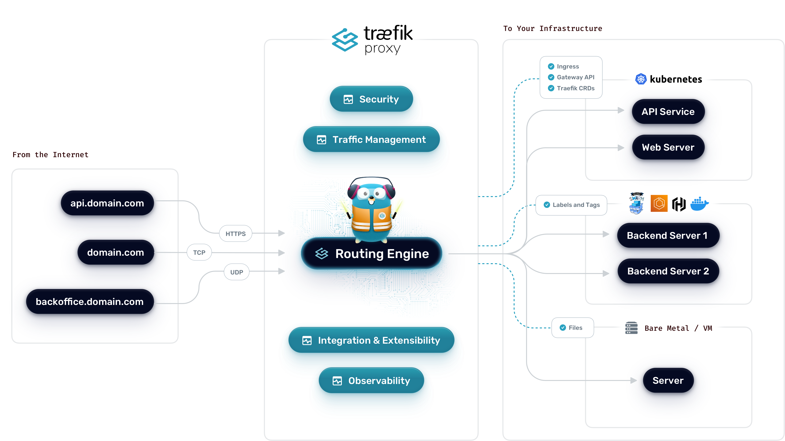
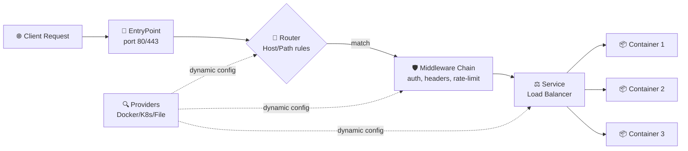
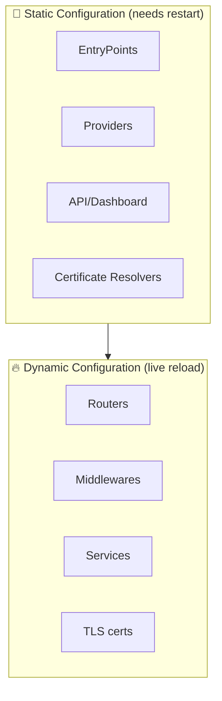
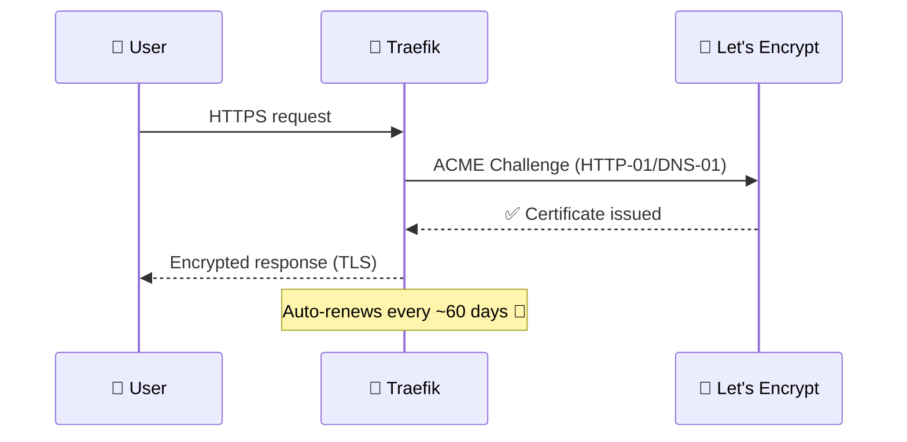
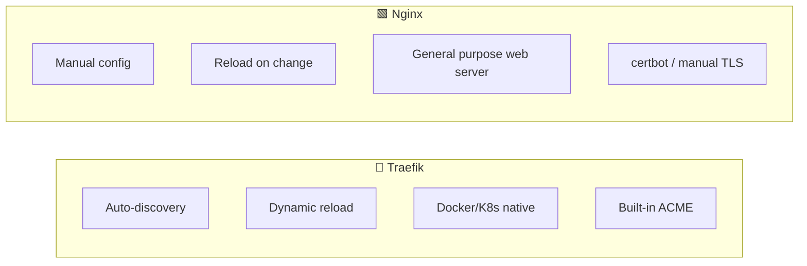
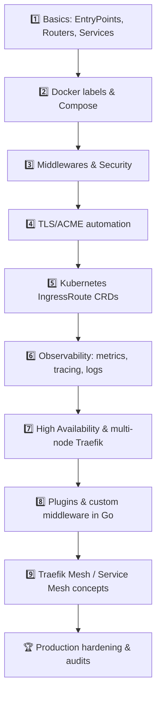

## 📚 Table of Contents

- [📚 Table of Contents](#-table-of-contents)
- [1. What is Traefik?🚦](#1-what-is-traefik)
- [2. Architecture 🏗️](#2-architecture-️)
  - [🧩 The building blocks](#-the-building-blocks)
  - [🔁 Static vs Dynamic Configuration (Architecture-level)](#-static-vs-dynamic-configuration-architecture-level)
- [3. Core Concepts 🧠](#3-core-concepts-)
  - [🔌 EntryPoints](#-entrypoints)
  - [🔍 Providers](#-providers)
  - [🧭 Routers](#-routers)
  - [🛡️ Middlewares](#️-middlewares)
  - [⚖️ Services](#️-services)
- [4. Installing Traefik with Docker 🐳](#4-installing-traefik-with-docker-)
  - [📁 Project structure](#-project-structure)
  - [🧾 `docker-compose.yml` — Minimal setup](#-docker-composeyml--minimal-setup)
  - [▶️ Run it](#️-run-it)
- [5. Configuration (Static vs Dynamic) ⚙️](#5-configuration-static-vs-dynamic-️)
  - [🧊 Static config — `traefik.yml`](#-static-config--traefikyml)
  - [🔥 Dynamic config — via Docker labels (most common)](#-dynamic-config--via-docker-labels-most-common)
  - [🔥 Dynamic config — via file (`dynamic.yml`)](#-dynamic-config--via-file-dynamicyml)
- [6. TLS / HTTPS with Let's Encrypt 🔐](#6-tls--https-with-lets-encrypt-)
- [7. Security Middlewares (for Security Engineers 🔒)](#7-security-middlewares-for-security-engineers-)
- [8. Django Behind Traefik — Real Example 🐍](#8-django-behind-traefik--real-example-)
- [9. Dashboard, Metrics \& Observability 📊](#9-dashboard-metrics--observability-)
- [10. Pros ✅ and Cons ❌](#10-pros--and-cons-)
  - [✅ Pros](#-pros)
  - [❌ Cons](#-cons)
- [11. Traefik vs Nginx — Full Comparison ⚖️](#11-traefik-vs-nginx--full-comparison-️)
  - [🎯 When to choose which?](#-when-to-choose-which)
- [12. Roadmap to Mastering Traefik 🎓](#12-roadmap-to-mastering-traefik-)
  - [Topics to master, in order:](#topics-to-master-in-order)
  - [📖 Resources](#-resources)
- [13. Cheatsheet 📋](#13-cheatsheet-)
  - [🏁 Summary](#-summary)

---

## 1. What is Traefik?🚦

**Traefik** ("traffic") is a modern, **cloud-native reverse proxy and load balancer** written in Go. Unlike traditional proxies, it is built to **auto-discover services** in dynamic environments (Docker, Kubernetes, Swarm, Consul, ECS...) and update its routing configuration **in real time, with zero restarts**.



**Key idea:** You don't tell Traefik "route /app to 10.0.0.5:8000" manually. You **label your containers**, and Traefik discovers them automatically. 🏷️

---

## 2. Architecture 🏗️

Traefik's architecture is built around a simple pipeline:



### 🧩 The building blocks

| Component | Emoji | Role |
|---|---|---|
| **Providers** | 🔍 | Discover services (Docker labels, Kubernetes CRDs, files, Consul...) |
| **EntryPoints** | 🔌 | Network entry points (ports Traefik listens on, e.g. `:80`, `:443`) |
| **Routers** | 🧭 | Match incoming requests (by Host, Path, Headers) and connect to a service |
| **Middlewares** | 🛡️ | Modify request/response: auth, redirect, rate-limit, headers, compress |
| **Services** | ⚖️ | Define how to reach the actual backend (load balancing, health checks) |

### 🔁 Static vs Dynamic Configuration (Architecture-level)



- **Static config** = the "engine" (loaded once at startup: `traefik.yml` / CLI flags / env vars).
- **Dynamic config** = the "rules" (loaded continuously, from providers, no restart needed). 🔄

---

## 3. Core Concepts 🧠

### 🔌 EntryPoints
Ports where Traefik listens.
```yaml
entryPoints:
  web:
    address: ":80"
  websecure:
    address: ":443"
```

### 🔍 Providers
Where Traefik gets its configuration:
- 🐳 **Docker / Docker Swarm**
- ☸️ **Kubernetes (Ingress / CRD)**
- 📄 **File** (YAML/TOML)
- 🗂️ **Consul, etcd, Zookeeper, Redis**
- ☁️ **ECS, Nomad**

### 🧭 Routers
```yaml
labels:
  - "traefik.http.routers.myapp.rule=Host(`app.example.com`)"
```

### 🛡️ Middlewares
Reusable pieces of logic: `basicAuth`, `rateLimit`, `redirectScheme`, `headers`, `ipWhiteList`, `compress`, `retry`, `circuitBreaker`.

### ⚖️ Services
The actual backend pool + load-balancing strategy (round-robin, weighted, sticky sessions).

---

## 4. Installing Traefik with Docker 🐳

### 📁 Project structure
```
traefik-lab/
├── docker-compose.yml
├── traefik/
│   ├── traefik.yml          # static config
│   ├── dynamic.yml          # optional dynamic config
│   └── acme.json            # TLS certs storage (chmod 600)
```

### 🧾 `docker-compose.yml` — Minimal setup

```yaml
version: "3.9"

services:
  traefik:
    image: traefik:v3.1
    container_name: traefik
    restart: unless-stopped
    command:
      - "--api.dashboard=true"
      - "--providers.docker=true"
      - "--providers.docker.exposedbydefault=false"
      - "--entrypoints.web.address=:80"
      - "--entrypoints.websecure.address=:443"
    ports:
      - "80:80"
      - "443:443"
      - "8080:8080"      # dashboard (secure this in production!)
    volumes:
      - "/var/run/docker.sock:/var/run/docker.sock:ro"
      - "./traefik/traefik.yml:/etc/traefik/traefik.yml:ro"
    networks:
      - web

  whoami:
    image: traefik/whoami
    container_name: whoami
    labels:
      - "traefik.enable=true"
      - "traefik.http.routers.whoami.rule=Host(`whoami.localhost`)"
      - "traefik.http.routers.whoami.entrypoints=web"
    networks:
      - web

networks:
  web:
    external: false
```

### ▶️ Run it
```bash
docker compose up -d
curl -H "Host: whoami.localhost" http://localhost
```

✅ That's it — Traefik automatically discovered the `whoami` container via its **labels**, no manual routing config needed!

> ⚠️ **Security note (relevant to your field):** Mounting `docker.sock` gives Traefik root-equivalent access to the host. In production, use a **socket proxy** (e.g. `tecnativa/docker-socket-proxy`) to limit what Traefik can query on the Docker API.

---

## 5. Configuration (Static vs Dynamic) ⚙️

### 🧊 Static config — `traefik.yml`
```yaml
api:
  dashboard: true

entryPoints:
  web:
    address: ":80"
  websecure:
    address: ":443"

providers:
  docker:
    exposedByDefault: false
  file:
    filename: /etc/traefik/dynamic.yml

log:
  level: INFO

accessLog: {}
```

### 🔥 Dynamic config — via Docker labels (most common)
```yaml
labels:
  - "traefik.enable=true"
  - "traefik.http.routers.django.rule=Host(`api.mysite.com`)"
  - "traefik.http.routers.django.entrypoints=websecure"
  - "traefik.http.routers.django.tls=true"
  - "traefik.http.services.django.loadbalancer.server.port=8000"
```

### 🔥 Dynamic config — via file (`dynamic.yml`)
```yaml
http:
  routers:
    api-router:
      rule: "PathPrefix(`/api`)"
      service: api-service
      middlewares:
        - rate-limit

  services:
    api-service:
      loadBalancer:
        servers:
          - url: "http://10.0.0.5:8000"

  middlewares:
    rate-limit:
      rateLimit:
        average: 100
        burst: 50
```

---

## 6. TLS / HTTPS with Let's Encrypt 🔐

Traefik can **auto-generate and renew** TLS certs — no certbot needed!

```yaml
# traefik.yml
certificatesResolvers:
  letsencrypt:
    acme:
      email: "you@example.com"
      storage: "/etc/traefik/acme.json"
      httpChallenge:
        entryPoint: web
```

```yaml
# docker-compose labels
labels:
  - "traefik.http.routers.django.tls.certresolver=letsencrypt"
  - "traefik.http.routers.web.rule=Host(`example.com`)"
  - "traefik.http.routers.web-secure.entrypoints=websecure"
```



---

## 7. Security Middlewares (for Security Engineers 🔒)

Since you work in **security**, these are the middlewares you'll use most:

| Middleware | Emoji | Purpose |
|---|---|---|
| `basicAuth` / `digestAuth` | 🔑 | Password-protect routes |
| `ipWhiteList` / `ipAllowList` | 🧱 | Restrict access by IP/CIDR |
| `rateLimit` | 🚧 | Prevent brute-force / DoS |
| `headers` | 🪖 | Force HSTS, CSP, X-Frame-Options |
| `redirectScheme` | ↪️ | Force HTTP → HTTPS |
| `forwardAuth` | 🛂 | Delegate auth to an external service (SSO, OAuth2-Proxy) |
| `inFlightReq` | 🚦 | Limit concurrent requests per source |

```yaml
labels:
  - "traefik.http.middlewares.secure-headers.headers.stsSeconds=31536000"
  - "traefik.http.middlewares.secure-headers.headers.contentTypeNosniff=true"
  - "traefik.http.middlewares.secure-headers.headers.frameDeny=true"
  - "traefik.http.middlewares.limit.ratelimit.average=50"
  - "traefik.http.middlewares.limit.ratelimit.burst=20"
  - "traefik.http.routers.django.middlewares=secure-headers,limit"
```

> 🛡️ **Defense-in-depth tip:** Combine `forwardAuth` with an external auth service (e.g. Authelia, OAuth2-Proxy) to add SSO/2FA in front of *any* backend — including legacy apps that don't support it natively.

---

## 8. Django Behind Traefik — Real Example 🐍

```yaml
version: "3.9"

services:
  traefik:
    image: traefik:v3.1
    command:
      - "--providers.docker=true"
      - "--entrypoints.web.address=:80"
      - "--entrypoints.websecure.address=:443"
      - "--certificatesresolvers.le.acme.httpchallenge=true"
      - "--certificatesresolvers.le.acme.httpchallenge.entrypoint=web"
      - "--certificatesresolvers.le.acme.email=you@example.com"
      - "--certificatesresolvers.le.acme.storage=/letsencrypt/acme.json"
    ports:
      - "80:80"
      - "443:443"
    volumes:
      - "/var/run/docker.sock:/var/run/docker.sock:ro"
      - "letsencrypt:/letsencrypt"
    networks: [web]

  django:
    build: .
    container_name: django_app
    command: gunicorn myproject.wsgi:application --bind 0.0.0.0:8000
    environment:
      - DJANGO_ALLOWED_HOSTS=api.example.com
    labels:
      - "traefik.enable=true"
      - "traefik.http.routers.django.rule=Host(`api.example.com`)"
      - "traefik.http.routers.django.entrypoints=websecure"
      - "traefik.http.routers.django.tls.certresolver=le"
      - "traefik.http.services.django.loadbalancer.server.port=8000"
      - "traefik.http.middlewares.django-headers.headers.stsSeconds=31536000"
      - "traefik.http.routers.django.middlewares=django-headers"
    networks: [web]

networks:
  web:
volumes:
  letsencrypt:
```

> 💡 Remember to set `SECURE_PROXY_SSL_HEADER = ('HTTP_X_FORWARDED_PROTO', 'https')` in your Django `settings.py` since Traefik terminates TLS and forwards plain HTTP to Gunicorn.

---

## 9. Dashboard, Metrics & Observability 📊

```yaml
command:
  - "--api.dashboard=true"
  - "--metrics.prometheus=true"
  - "--accesslog=true"
labels:
  - "traefik.http.routers.dashboard.rule=Host(`traefik.example.com`)"
  - "traefik.http.routers.dashboard.service=api@internal"
  - "traefik.http.routers.dashboard.middlewares=dashboard-auth"
  - "traefik.http.middlewares.dashboard-auth.basicauth.users=admin:$$apr1$$hashed..."
```

- 📈 **Prometheus** metrics endpoint built-in
- 📉 Integrates with **Grafana** dashboards
- 📝 Access logs in JSON or CLF format
- 🔎 Native **OpenTelemetry** tracing support (v3+)

> ⚠️ **Never expose the dashboard (`:8080`) publicly without auth** — it reveals your entire routing map and can leak internal service names.

---

## 10. Pros ✅ and Cons ❌

### ✅ Pros
- 🔄 **Zero-downtime, auto-discovery** — no reload/restart when containers change
- 🐳 **Native integration** with Docker, Swarm, Kubernetes, Consul, ECS
- 🔐 **Built-in ACME/Let's Encrypt** — automatic HTTPS
- 🏷️ **Label-based config** — infrastructure-as-code friendly, lives next to your app
- 📊 Built-in dashboard, metrics, tracing
- 🧩 Modular middleware system
- 🌍 Great for **microservices** and multi-tenant setups

### ❌ Cons
- 🐢 Slightly **higher latency/lower raw throughput** than Nginx under extreme load (Go GC overhead)
- 📖 **Smaller community & fewer tutorials** than Nginx (though growing fast)
- 🧠 Learning curve for **label syntax** and dynamic vs static config split
- 🧵 Advanced request rewriting (complex `rewrite` rules) is less mature than Nginx's `rewrite`/Lua (OpenResty)
- 💾 Config sprawl risk if labels aren't organized well across many services
- 🧪 Some enterprise features (advanced WAF-like behavior) need plugins or Traefik Enterprise (paid)

---

## 11. Traefik vs Nginx — Full Comparison ⚖️



| Feature | 🚦 Traefik | 🟩 Nginx |
|---|---|---|
| **Primary role** | Reverse proxy / API gateway for dynamic infra | Web server + reverse proxy (general purpose) |
| **Service discovery** | ✅ Native (Docker, K8s, Consul...) | ❌ Manual / needs `nginx-gen`, `consul-template` |
| **Config reload** | ✅ Live, zero downtime | ⚠️ Needs `nginx -s reload` (graceful, but manual trigger) |
| **HTTPS / Let's Encrypt** | ✅ Built-in ACME client | ❌ Needs external `certbot` |
| **Static file serving** | ⚠️ Basic | ✅ Excellent, highly optimized |
| **Raw performance (req/s)** | 🟡 Very good | 🟢 Slightly better (mature C codebase) |
| **Configuration style** | Labels / YAML / CRDs (declarative, per-service) | `nginx.conf` (centralized, imperative) |
| **Kubernetes integration** | ✅ Ingress Controller + native CRDs | ✅ via `ingress-nginx` (also excellent) |
| **Dashboard/UI** | ✅ Built-in web UI | ❌ None natively (needs 3rd-party) |
| **Middleware/plugins** | ✅ Rich, composable, Go plugins | ✅ Modules + Lua (OpenResty) — more mature |
| **Learning curve (for microservices)** | 🟢 Easier once labels are understood | 🟡 More manual, but very well documented |
| **Best for** | Containers, microservices, ephemeral infra | Static sites, high-perf serving, fine-grained control |
| **Community size** | Growing, strong in cloud-native space | Massive, industry standard for decades |
| **Enterprise/WAF features** | Traefik Enterprise / Hub (paid add-ons) | ModSecurity, Nginx Plus (paid) |

### 🎯 When to choose which?

- **Choose Traefik** if: you run **Docker/Kubernetes microservices**, services scale up/down often, and you want automatic HTTPS + zero-touch routing. 🐳
- **Choose Nginx** if: you need **raw performance**, serve lots of **static content**, want the most battle-tested option, or need advanced **Lua scripting / ModSecurity WAF**. 🟩
- **Many teams use both**: Nginx as the edge/static server + Traefik as the internal service mesh router. 🤝

---

## 12. Roadmap to Mastering Traefik 🎓



### Topics to master, in order:

1. **Fundamentals** — EntryPoints, Routers, Services, Middlewares, Providers
2. **Docker & Compose** — labels, networks, `exposedByDefault`
3. **Security hardening** 🔒 — socket proxy, dashboard auth, rate limiting, IP allow-listing, forwardAuth/SSO integration (directly useful in your security role!)
4. **TLS automation** — HTTP-01 vs DNS-01 challenges, wildcard certs, cert rotation
5. **Kubernetes** — IngressRoute, Middleware CRDs, TraefikService, canary/blue-green deployments
6. **Observability** — Prometheus + Grafana dashboards, OpenTelemetry tracing, structured access logs
7. **High Availability** — running multiple Traefik replicas behind a Layer 4 LB (e.g. keepalived, cloud LB)
8. **Plugins** — writing custom middleware in Go (Traefik Plugin system / Yaegi interpreter)
9. **Service Mesh** — Traefik Mesh / Traefik Hub for east-west traffic
10. **Production audit checklist** — TLS config (SSL Labs A+), header hardening, log retention, secrets management

### 📖 Resources
- Official docs: https://doc.traefik.io/traefik/
- GitHub: https://github.com/traefik/traefik
- Awesome-Traefik community lists (labels examples, plugin catalog)

---

## 13. Cheatsheet 📋

```bash
# Check running config via API
curl http://localhost:8080/api/rawdata | jq

# Validate a static config file
traefik --configFile=traefik.yml --dry-run

# See logs
docker logs -f traefik

# Common label snippets
traefik.enable=true
traefik.http.routers.<name>.rule=Host(`example.com`)
traefik.http.routers.<name>.entrypoints=websecure
traefik.http.routers.<name>.tls.certresolver=letsencrypt
traefik.http.services.<name>.loadbalancer.server.port=<port>
traefik.http.middlewares.<name>.basicauth.users=user:hash
```

---

### 🏁 Summary

> Traefik shines in **dynamic, containerized environments** where services come and go — it auto-discovers, auto-secures (TLS), and auto-updates routing with **zero manual reloads**. Nginx remains the gold standard for **raw performance and static content**. As a **security-minded backend developer**, mastering Traefik's middleware chain (auth, rate-limiting, headers) gives you a powerful, code-adjacent way to enforce security policy right at the edge — often before a request ever reaches your Django app. 🐍🔒